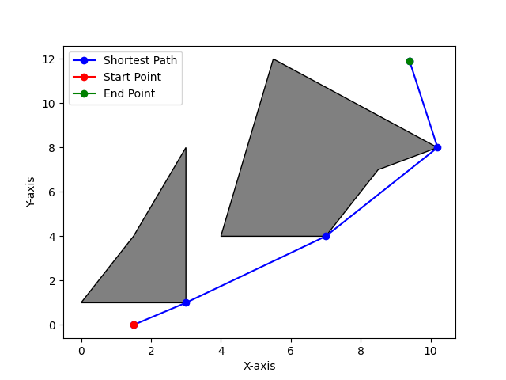

# ADA Project - Group 15

## Shortest Path Finding in the Presence of Polygonal Obstacles

Welcome to the ADA (Algorithms and Data Structures) project of Group 15! This project focuses on finding the shortest path from a starting point to a target point in the presence of polygonal obstacles.

### Group Members:
- Prashant Singh
- Aditya Patil
- Alankrit Kadian
- Nakul Alawadhi
- Keshav Aggarwal

### Project Overview:

The objective of this project is to implement an algorithm that efficiently calculates the shortest path between a given starting point and a target point while considering the presence of polygonal obstacles. The algorithm takes into account the geometry of the obstacles to ensure a realistic path is generated.

### Instructions to Run:

To run the project, follow these steps:
1. Open the `main.py` file in your preferred text editor.

2. Locate the section in the code where polygon points are defined. It typically looks like this:

   ```python
   # Define polygon points here
   polys = [
       [Polygon1],[Polygon2]
       # ... add more polygons as needed
   ]
   ```

   Manually update the `polys` list with the coordinates of your polygonal obstacles.

5. Save the changes to `main.py`.

6. Open a terminal or command prompt in the project directory.

7. Run the following command to execute the main script:

   ```bash
   python main.py
   ```

8. Follow the on-screen prompts to input the starting point and target point.

9. The program will then calculate and display the shortest path considering the specified polygonal obstacles.




Happy navigating through the world of polygonal obstacles! 🚀